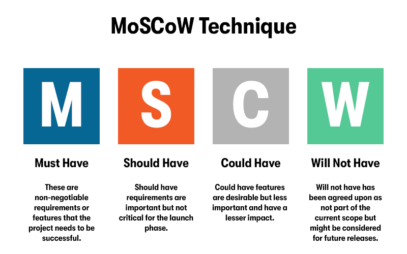

# MoSCoW Feedback Analysis – GitHub

## Customer Feedback (Hypothetical)
1. **Valuable Features** – Version control, pull requests, and GitHub Actions.  
2. **Missing Features** – More intuitive project dashboards; stronger real-time collaboration tools.  
3. **UI/UX Feedback** – Some users find navigation overwhelming; want simplified dashboards.  
4. **Recurring Issues** – Merge conflict handling complexity; slow build times on large projects.  
5. **Suggestions** – Integrations with more third-party tools; customizable analytics dashboards.

---

## MoSCoW Matrix

### Must-Have
- Secure version control and repository hosting.  
- Pull requests and code review features.  
- GitHub Actions for CI/CD automation.  
- Strong security scanning (dependencies & secrets).

### Should-Have
- Simplified navigation/dashboard UI improvements.  
- Better merge conflict resolution tools.  
- Expanded integrations (Slack, Jira, Trello).  

### Could-Have
- Customizable analytics dashboards.  
- Real-time code collaboration (Google Docs-style).  
- Enhanced mobile app functionality.  

### Won’t-Have (for now)
- Advanced AR/VR developer collaboration features.  
- Built-in design prototyping tools (already covered by Figma).  

---

## Roadmap Insights
- **Short-term focus**: Must-haves to ensure reliability and adoption.  
- **Medium-term**: Should-haves to improve usability and workflow integration.  
- **Long-term**: Could-haves for differentiation and innovation.  
- **Exclusions**: Avoid distractions that do not align with core developer needs.  

---

## References
- Product Prioritization Frameworks. (2022, February 23). *Productboard*. https://www.productboard.com/glossary/product-prioritization-frameworks/  
- The Ultimate Guide to Product Prioritization + 8 Frameworks. (n.d.). *Product School*. https://productschool.com/blog/product-fundamentals/ultimate-guide-product-prioritization  

